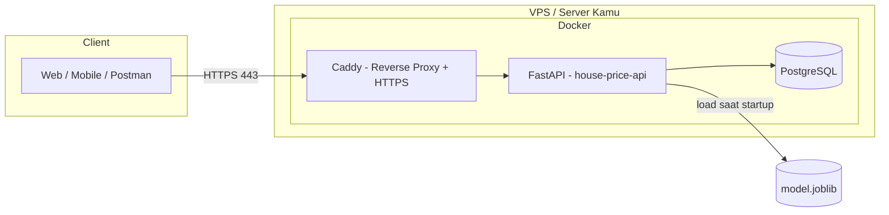

# 🚀 FastAPI Crash Course — dari Nol sampai Deploy Produksi

> **Case study real project:** API Prediksi Harga Rumah (`house-price-api`)
> — dari memahami dasar FastAPI sampai jalan di VPS dengan Docker + HTTPS.

Course ini kubuat khusus buat kamu yang **sudah pernah pakai FastAPI untuk tesis**,
tapi belum pernah deploy ke level produksi. Jadi fokusnya bukan cuma "bisa bikin API",
tapi **memahami FastAPI dengan benar** dan **membawa project ke produksi** — pola yang
sama persis dengan tesis kamu (SQLAlchemy + PostgreSQL, Pydantic v2, model ML via joblib).

---

## 🎯 Kenapa case study ini?

Tesis kamu (dari jawaban sebelumnya) pakai:

- **SQLAlchemy + PostgreSQL** → database
- **Pydantic v2** → validasi/schema
- **Model ML (joblib/pickle/onnx)** → ada inference

Course ini membuat project yang **mencerminkan pola itu**, tapi lebih kecil dan fokus
belajar. Kalau kamu paham project ini, kamu tinggal "menyalin pola"-nya ke tesis kamu.

Kita akan membangun **API Prediksi Harga Rumah** dengan fitur:

| Fitur                                 | Alasan                                                       |
| ------------------------------------- | ------------------------------------------------------------ |
| `POST /auth/register` & `/auth/login` | Belajar JWT auth (dipakai hampir semua aplikasi)             |
| `POST /predictions`                   | Menerima fitur rumah → panggil model ML → simpan hasil ke DB |
| `GET /predictions`                    | Riwayat prediksi per user (pagination)                       |
| `GET /health`                         | Healthcheck untuk Docker & monitoring                        |
| Model ML (joblib)                     | Dipanggil dari dalam FastAPI (persis pola tesis kamu)        |

---

## 🗺️ Peta Belajar (8 Fase)

| Fase                           | Materi                                          | Hasil                                   |
| ------------------------------ | ----------------------------------------------- | --------------------------------------- |
| **Fase 0** — Persiapan         | env, tooling, hello world, konsep ASGI/Uvicorn  | FastAPI pertama jalan                   |
| **Fase 1** — Inti FastAPI      | routing, params, Pydantic, error handling       | Paham cara kerja inti FastAPI           |
| **Fase 2** — Struktur Proyek   | layering, settings, `.env`, CORS, lifespan      | Kerangka proyek profesional             |
| **Fase 3** — Database          | SQLAlchemy 2.0 + PostgreSQL, dependency session | Tabel `users` & `predictions` + CRUD    |
| **Fase 4** — Auth JWT          | bcrypt, PyJWT, OAuth2, proteksi route           | Register/login + endpoint terproteksi   |
| **Fase 5** — Model ML          | latih model, load di startup, endpoint predict  | Prediksi tersimpan ke DB                |
| **Fase 6** — Testing & Logging | pytest, background task, logging                | API teruji otomatis                     |
| **Fase 7** — Docker            | Dockerfile, Compose, healthcheck                | API + Postgres berjalan dalam container |
| **Fase 8** — Deploy Produksi   | VPS, Caddy + HTTPS, secrets, backup, monitoring | API live di internet 🎉                 |

> 💡 **Tips belajar:** jangan skip fase. Tiap fase ada bagian **"Cek hasil"** — jalankan
> dan pastikan berhasil dulu sebelum lanjut (kamu kan suka eksekusi bertahap 😄).

---

## 📁 Struktur Course

```
fastapi crash course/
├── README.md                  ← kamu di sini
├── fase-0-persiapan/README.md
├── fase-1-fastapi-inti/README.md
├── fase-2-struktur-proyek/README.md
├── fase-3-database/README.md
├── fase-4-auth-jwt/README.md
├── fase-5-model-ml/README.md
├── fase-6-testing-logging/README.md
├── fase-7-docker/README.md
├── fase-8-deploy-produksi/README.md
└── house-price-api/           ← proyek akhir (kode lengkap & siap jalan)
    ├── app/
    ├── tests/
    ├── Dockerfile
    ├── docker-compose.yml
    ├── docker-compose.prod.yml
    └── ...
```

Setiap fase = folder berisi `README.md` (penjelasan konsep + langkah + kode).
Di akhir course, semua kode kamu dikumpulkan di folder **`house-price-api/`** — itu
proyek nyata yang siap dideploy.

---

## ⚙️ Prasyarat

- **Python 3.11+** terpasang (cek: `python3 --version`)
- **Docker Desktop** (untuk PostgreSQL & deploy) — cek: `docker --version`
- Editor: VS Code (yang kamu pakai sekarang 😊)
- Semangat belajar bertahap 🔥

> Kalau belum punya salah satu prasyarat, mulai dari **Fase 0** — semua cara install
> dijelaskan di sana.

---

## 🚦 Alur Menjalankan Course

1. Ikuti fase dari 0 sampai 8 secara urut.
2. Tiap fase ada kode yang kamu tulis sendiri di folder `house-price-api/`.
3. Bandingkan dengan kode acuan kalau macet.
4. Fase 7–8 fokus ke "produksi" — bagian yang paling kamu bingungkan.

**Mulai dari [Fase 0 — Persiapan](./fase-0-persiapan/README.md) 👈**

---

## 🧭 Ringkasan Arsitektur Akhir



> Penjelasan arsitektur di atas bakal masuk akal setelah Fase 7–8. Simpelnya:
> **Caddy** = pintu masuk (aman/HTTPS), **FastAPI** = otak aplikasi, **PostgreSQL** =
> tempat simpan data, **model.joblib** = file model ML yang kamu latih.

---

Selamat belajar! 🎓 Kalau ada langkah yang bikin bingung, tanya aja — kita kerjain bareng.
