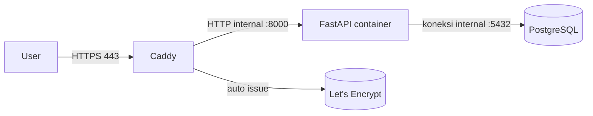

# Fase 8 — Deploy Produksi di VPS 🚀 (bagian yang paling kamu tunggu!)

**Tujuan fase ini:**

- Paham arsitektur produksi: Caddy (reverse proxy) → FastAPI → PostgreSQL.
- Menyiapkan VPS yang aman (user, firewall, Docker).
- Deploy dengan `docker-compose.prod.yml` + HTTPS otomatis (Let's Encrypt via Caddy).
- Paham cara update aplikasi, backup database, dan baca log.
- Checklist final untuk go-live / ujian sidang.

> Ini bagian yang sebelumnya bikin kamu bingung. Tenang — kita pecah jadi langkah
> kecil. Setelah fase ini, kamu akan paham **seluruh perjalanan dari `main.py` sampai
> aplikasi live di internet**.

---

## 1. Konsep: Arsitektur produksi (kenapa tidak langsung expose Uvicorn?)

Kamu mungkin bertanya: _"kenapa tidak langsung aja `uvicorn` di port 8000 ke internet?"_

Bisa, tapi ada masalah:

1. **HTTPS** — browser modern menandai situs non-HTTPS sebagai "not secure". Ngurus
   sertifikat SSL manual itu ribet.
2. **Header & keamanan** — butuh lapisan yang menangani hal teknis HTTP (gzip, header
   aman, batas ukuran body, dll).
3. **Satu pintu masuk** — nanti kalau kamu punya frontend/web lain, tinggal daftarkan
   di reverse proxy.

Solusi standar industri: **reverse proxy** di depan aplikasi.



- **Caddy** = reverse proxy modern yang **HTTPS-nya otomatis** (Let's Encrypt). Tidak
  perlu konfigurasi sertifikat manual.
- Client hanya melihat port **80/443**. Port internal (8000, 5432) **tidak terbuka ke
  publik** — ini bagus untuk keamanan.

---

## 2. Siapkan file produksi di project

### Buat file **`docker-compose.prod.yml`** (timpa/baru):

```yaml
services:
  db:
    image: postgres:16-alpine
    restart: unless-stopped
    environment:
      POSTGRES_USER: ${POSTGRES_USER}
      POSTGRES_PASSWORD: ${POSTGRES_PASSWORD}
      POSTGRES_DB: ${POSTGRES_DB}
    volumes:
      - pgdata:/var/lib/postgresql/data
    healthcheck:
      test: ["CMD-SHELL", "pg_isready -U ${POSTGRES_USER} -d ${POSTGRES_DB}"]
      interval: 10s
      timeout: 5s
      retries: 5

  api:
    build: .
    restart: unless-stopped
    env_file: .env # baca SECRET_KEY, CORS, dsb dari .env di server
    environment:
      # hostname database di dalam jaringan docker = "db"
      DATABASE_URL: postgresql+psycopg://${POSTGRES_USER}:${POSTGRES_PASSWORD}@db:5432/${POSTGRES_DB}
    expose:
      - "8000" # hanya bisa diakses dari dalam jaringan docker
    depends_on:
      db:
        condition: service_healthy
    healthcheck:
      test: ["CMD", "curl", "-f", "http://localhost:8000/api/v1/health"]
      interval: 30s
      timeout: 5s
      retries: 3

  caddy:
    image: caddy:2-alpine
    restart: unless-stopped
    ports:
      - "80:80" # HTTP (untuk redirect ke HTTPS)
      - "443:443" # HTTPS
    environment:
      DOMAIN: ${DOMAIN}
    volumes:
      - ./Caddyfile:/etc/caddy/Caddyfile:ro
      - caddy_data:/data # simpan sertifikat Let's Encrypt
      - caddy_config:/config
    depends_on:
      - api

volumes:
  pgdata:
  caddy_data:
  caddy_config:
```

**Perhatikan perbedaan dengan compose development:**

- `restart: unless-stopped` → kalau server restart / container crash, Docker menyalakan
  lagi otomatis. Ini penting di VPS!
- `db` **tidak** mem-publish port 5432 ke host (tidak ada baris `ports`) → DB tidak
  bisa diakses dari luar.
- `api` memakai `expose` (internal) bukan `ports` → hanya Caddy yang bisa menjangkaunya.
- Nilai rahasia diisi lewat `${...}` yang dibaca dari file `.env` di server.

### Buat file **`Caddyfile`**:

```caddyfile
# Caddyfile — reverse proxy + HTTPS otomatis (Let's Encrypt)
# Nilai $DOMAIN diisi dari environment (baris "environment" di compose)

{$DOMAIN} {
    # Semua request ke domain ini diteruskan ke service "api" port 8000
    reverse_proxy api:8000
}
```

### Buat file **`.env.prod.example`** (template untuk server):

```bash
# ===== Production configuration =====
# Salin jadi .env di server:  cp .env.prod.example .env

# Environment
APP_ENV=production
DEBUG=false

# Domain — arahkan DNS "A record" ke IP server kamu
DOMAIN=api.contoh-tesis.com

# Database (GANTI password!)
POSTGRES_USER=app
POSTGRES_PASSWORD=GANTI_PASSWORD_KUAT
POSTGRES_DB=house_price

# Jangan set DATABASE_URL di sini — docker-compose.prod.yml yang mengatur ke host "db"

# Auth — buat secret kuat:  openssl rand -hex 32
SECRET_KEY=GANTI_DENGAN_SECRET_PANJANG_ACAK
ACCESS_TOKEN_EXPIRE_MINUTES=60

# Model ML
MODEL_PATH=app/ml/artifacts/model.joblib
MODEL_VERSION=v1.0.0

# CORS — isi origin frontend/produk kamu
CORS_ORIGINS=["https://frontend.contoh-tesis.com"]
```

> ⚠️ **JANGAN commit `.env`** (sudah ada di `.gitignore`). File `.env.prod.example`
> boleh di-commit karena isinya cuma template.

---

## 3. Siapkan VPS

Kita pakai contoh VPS **Ubuntu** (DigitalOcean/Vultr/Hetzner/IDCloudHost, dll).

### a. Buat server & akses SSH

1. Buat droplet/VPS Ubuntu 22.04/24.04 (spec minimum 2 vCPU / 2GB sudah cukup).
2. Tambahkan **SSH key** kamu saat pembuatan (lebih aman daripada password).
3. SSH masuk:
   ```bash
   ssh root@IP_SERVER
   ```

### b. Update sistem & buat user biasa (best practice)

```bash
# update sistem
apt update && apt upgrade -y

# buat user deploy (ganti "deploy" bebas)
adduser deploy
usermod -aG sudo deploy

# salin SSH key root ke user deploy
rsync --archive --chown=deploy:deploy ~/.ssh /home/deploy/
```

Setelah ini, keluar & login sebagai `deploy`:

```bash
exit
ssh deploy@IP_SERVER
```

### c. Install Docker + Compose plugin

```bash
curl -fsSL https://get.docker.com -o get-docker.sh
sudo sh get-docker.sh
sudo usermod -aG docker $USER
# log out-in sekali supaya grup docker aktif:
exit
ssh deploy@IP_SERVER

# cek
docker --version
docker compose version
```

### d. Firewall (hanya buka SSH, HTTP, HTTPS)

```bash
sudo ufw allow OpenSSH
sudo ufw allow 80/tcp
sudo ufw allow 443/tcp
sudo ufw enable
sudo ufw status
```

> Dengan ini, port lain (termasuk 5432 & 8000) **tertutup dari luar**. Request hanya
> lewat Caddy (80/443).

---

## 4. Kirim project ke server

Dari laptop (di folder `house-price-api`), ada 2 cara:

**Cara A — via Git (disarankan):**

```bash
# di laptop: pastikan project sudah di push ke GitHub/GitLab
git remote add origin <URL_REPO>
git push -u origin main
```

```bash
# di server
git clone <URL_REPO> house-price-api
cd house-price-api
```

**Cara B — via scp (tanpa repo):**

```bash
# di laptop
scp -r . deploy@IP_SERVER:~/house-price-api
```

```bash
# di server
cd ~/house-price-api
```

### Siapkan `.env` produksi di server

```bash
cp .env.prod.example .env
nano .env        # isi DOMAIN, password DB, SECRET_KEY, CORS
```

Buat `SECRET_KEY` acak yang kuat:

```bash
openssl rand -hex 32
```

---

## 5. Arahkan DNS ke server

Di panel domain kamu (Namecheap/Cloudflare/IDCloudHost dll):

1. Buat **A record**: `api` → `<IP_SERVER>` (misal `api.contoh-tesis.com`).
2. Tunggu propagasi DNS (beberapa menit sampai beberapa jam).

Cek dari laptop:

```bash
dig +short api.contoh-tesis.com
# → harus menampilkan IP server kamu
```

---

## 6. Deploy! 🎉

```bash
# di folder ~/house-price-api di server
docker compose -f docker-compose.prod.yml up -d --build
```

Proses yang terjadi otomatis:

1. Build image (termasuk melatih model ML di dalam image).
2. Start `db` → tunggu `healthy`.
3. Start `api` → tunggu `healthy`.
4. Start `caddy` → minta sertifikat HTTPS ke Let's Encrypt.

Cek status:

```bash
docker compose -f docker-compose.prod.yml ps
```

Buka browser: **https://api.contoh-tesis.com/docs** — API kamu **live di internet
dengan HTTPS**! 🎉

> 💡 HTTPS pertama kali butuh beberapa detik/menit karena Caddy mengurus sertifikat.
> Kalau belum muncul, cek log: `docker compose -f docker-compose.prod.yml logs caddy`.

---

## 7. Update aplikasi (deploy versi baru)

Alur rilis yang benar:

```bash
# 1. pull kode terbaru (kalau pakai git)
git pull

# 2. build ulang & restart
docker compose -f docker-compose.prod.yml up -d --build

# 3. pastikan sehat
docker compose -f docker-compose.prod.yml ps
```

**Yang TIDAK boleh dilakukan:** menghapus volume (`down -v`) saat update — itu akan
menghapus **seluruh data**. Untuk restart biasa cukup:

```bash
docker compose -f docker-compose.prod.yml restart api
```

---

## 8. Backup database (WAJIB sebelum sidang/demo penting!)

Database = data yang tidak bisa diganti. Backup rutin itu wajib.

```bash
# backup manual → file .sql di home
docker compose -f docker-compose.prod.yml exec -T db \
  pg_dump -U app house_price > backup_$(date +%F).sql

# restore (saat dibutuhkan)
cat backup_2026-01-01.sql | docker compose -f docker-compose.prod.yml exec -T db \
  psql -U app house_price
```

> 💡 Untuk backup otomatis harian, tambahkan **cron**:
>
> ```bash
> crontab -e
> # tambah baris (jalan tiap jam 3 pagi):
> 0 3 * * * cd ~/house-price-api && docker compose -f docker-compose.prod.yml exec -T db pg_dump -U app house_price > ~/backups/house_price_$(date +\%F).sql
> ```
>
> (Simpan backup di tempat lain juga — jangan satu server saja.)

---

## 9. Log & troubleshooting

```bash
# log aplikasi (ikuti real-time, Ctrl+C untuk keluar)
docker compose -f docker-compose.prod.yml logs -f api

# log semua service
docker compose -f docker-compose.prod.yml logs -f

# restart satu service
docker compose -f docker-compose.prod.yml restart api

# cek kesehatan
curl https://api.contoh-tesis.com/api/v1/health
```

Troubleshooting cepat:
| Gejala | Cek |
|---|---|
| 502 dari Caddy | `logs caddy`, apakah `api` sehat? `docker compose ps` |
| 503 model | apakah file `model.joblib` terbentuk saat build? `logs api` |
| Database error | `logs db`, pastikan `POSTGRES_*` di `.env` konsisten |
| Sertifikat gagal | DNS belum mengarah / port 80 tertutup |

---

## 10. Migrasi database (Alembic) — catatan produksi

`Base.metadata.create_all()` (dipakai saat dev) **tidak bisa mengubah** tabel yang
sudah ada (menambah kolom, dsb). Di produksi sejati, gunakan **Alembic** (alat migrasi
resmi SQLAlchemy):

```bash
pip install alembic
alembic init alembic
# set sqlalchemy.url di alembic.ini / env.py memakai settings.DATABASE_URL
alembic revision --autogenerate -m "tambah kolom baru"
alembic upgrade head
```

Konsepnya: setiap perubahan skema = satu "revisi" yang tersimpan & bisa dijalankan ke
atas/bawah dengan aman. Untuk project demo/sidang, `create_all` + backup DB sudah
cukup; kalau aplikasi kamu sudah dipakai beneran, pelajari Alembic.

---

## 11. Checklist go-live & ujian sidang ✅

**Keamanan:**

- [ ] `.env` tidak ikut ter-commit (cek `git status`).
- [ ] `SECRET_KEY` panjang & acak (bukan default).
- [ ] Password PostgreSQL kuat.
- [ ] SSH hanya pakai key (nonaktifkan login password root).
- [ ] Firewall hanya buka 22/80/443.
- [ ] Port 5432 & 8000 tidak terbuka ke publik.

**Aplikasi:**

- [ ] `python -m pytest` hijau sebelum deploy.
- [ ] `/api/v1/health` menampilkan `status: ok` & `model_ready: true`.
- [ ] Test end-to-end di https://domain/docs: register → login → predict → riwayat.
- [ ] CORS sudah berisi origin frontend kamu.

**Operasional:**

- [ ] Backup DB sudah dibuat & bisa di-restore.
- [ ] Tahu cara baca log (`docker compose logs`).
- [ ] Tahu alur update (`git pull` + `up -d --build`).
- [ ] (Opsional) cron backup harian aktif.

**Demo sidang (tips):**

- Siapkan **skenario demo**: register akun → login → input fitur → tunjukkan hasil
  prediksi masuk ke database → tunjukkan riwayat.
- Siapkan **fallback offline**: kalau internet VPS bermasalah saat sidang, jalankan
  versi lokal (`docker compose up -d --build`) dan demo dari localhost.
- Jelaskan arsitektur dengan diagram di atas — penguji suka yang paham alur, bukan
  sekadar "kodenya jalan".

---

## 12. Yang kamu pelajari di fase ini (rekap besar)

- Arsitektur produksi: **Caddy (HTTPS otomatis) → FastAPI → PostgreSQL**.
- Menyiapkan VPS: user, Docker, firewall, DNS.
- Deploy dengan `docker-compose.prod.yml` & secrets via `.env`.
- Alur update, backup, dan troubleshooting.
- Checklist go-live untuk sidang.

---

## 🎉 SELAMAT! Kamu sudah menyelesaikan course-nya.

Dari "bingung cara deploy" → sekarang kamu punya **API produksi yang live**, teruji,
dengan database & model ML — persis pola tesis kamu. Tinggal ganti data & model trainer
dengan punyamu.

Kalau mau, kita bisa lanjut:

- Menambahkan **Alembic** ke project.
- Membuat **frontend/web kecil** (React/vanilla) yang konsumsi API ini.
- Menambahkan **CI/CD** (auto test + auto deploy saat push).
- Menyesuaikan trainer dengan **dataset tesis kamu** yang asli.

Pilih aja mau lanjut ke mana 😄
